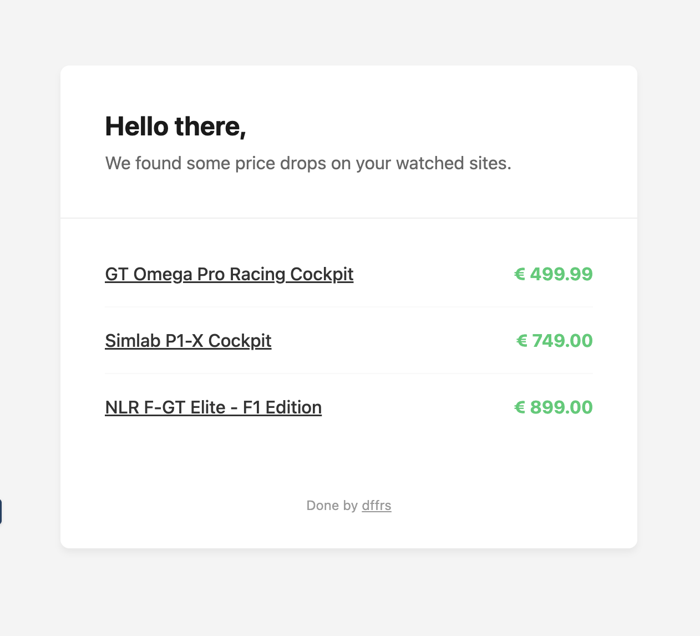

# scrappy

> ⚠️ Work in progress

A Go application that monitors sim-racing cockpit prices across a few websites, tracks price history, and sends an email alert whenever a price drops.

Designed to run once per day via a cron job.

---

## How it works

1. Scrapes product listings from Simlab, GT Omega, and Next Level Racing
2. Saves each product and its current price to SQLite
3. Compares today's price with the last recorded one
4. If any prices dropped → sends an email alert

---

## Project structure

```
scrappy/
├── cmd/
│   ├── scrappy/                # Entry point
│   │   └── main.go
│   └── migrate/                # DB migration CLI
│       └── migrations/         # SQL up/down files
├── internal/
│   ├── database/               # SQLite models
│   │   ├── history.go
│   │   ├── models.go
│   │   ├── openDB.go
│   │   ├── product.go
│   │   └── site.go
│   ├── mail/                   # Email handling
│   │   ├── config.go
│   │   └── mail.go
│   ├── scraper/                # Scraper modules
│   │   ├── extractPrice.go
│   │   ├── gtomega.go
│   │   ├── nextlevelracing.go
│   │   ├── saveProducts.go
│   │   ├── scraper.go
│   │   ├── scrapSites.go
│   │   └── simlab.go
│   └── types/                  # Shared types
│       └── target.go
├── assets/
│   └── template.html          # HTML email template
└── Makefile
```

---

## Requirements

- Go 1.26+
- GCC (required by `go-sqlite3` via CGO)
- Chrome or Chromium (required by the GT Omega scraper)

---

## Setup

### 1. Run the migrations

```bash
make upDB
```

### 2. Configure email

On first run, scrappy will look for `scrappy.env` in your OS config directory and create an empty template if it doesn't exist:

```
~/.config/scrappy.env                        # Linux
~/Library/Application Support/scrappy.env   # macOS
```

Fill it in:

```env
FROM=you@example.com
TO=recipient@example.com
PASSWORD=your_smtp_password
HOST=smtp.example.com
PORT=587
```

Gmail is supported. Use `smtp.gmail.com` as the host, port `587`, and an [App Password](https://support.google.com/accounts/answer/185833) instead of your regular account password.

### 3. Build and run

```bash
make build
./bin/scrappy
```

---

## Usage

Once set up, run it manually:

```bash
./bin/scrappy
```

Or schedule it as a daily cron job:

```bash
# Runs every day at 08:00
0 8 * * * /path/to/scrappy/bin/scrappy
```

On the first run, scrappy will populate the database with current prices — no email will be sent since there's no previous price to compare against. From the second run onwards, it will start detecting drops.

---

## Email preview



---

## Makefile targets

| Target         | Description                             |
| -------------- | --------------------------------------- |
| `make build`   | Format → vet → compile to `bin/scrappy` |
| `make upDB`    | Apply migrations (create tables)        |
| `make downDB`  | Roll back migrations (drop tables)      |
| `make resetDB` | Full schema wipe and recreate           |

---

## Adding a scraper

Implement the `Scrapees` interface and register it in `cmd/scrappy.go`:

```go
type MyNewSite struct{}

func (m MyNewSite) Run() ([]types.Product, error) {
    // scrape and return products
}
```

```go
scrapees := map[string]types.Scrapees{
    // ...existing scrapers...
    "mynewsite": internal.MyNewSite{},
}
```

---

## Exit codes

| Code | Meaning                          |
| ---- | -------------------------------- |
| `0`  | Success — email sent             |
| `1`  | Error                            |
| `2`  | No price drops — nothing to send |

## TODO

- [x] Code clean up
- [x] Show old price on email
- [x] Instead of detecting price drops, detect price changes - this way price increases would be flagged
- [x] Make websites to be scrapped configurable
